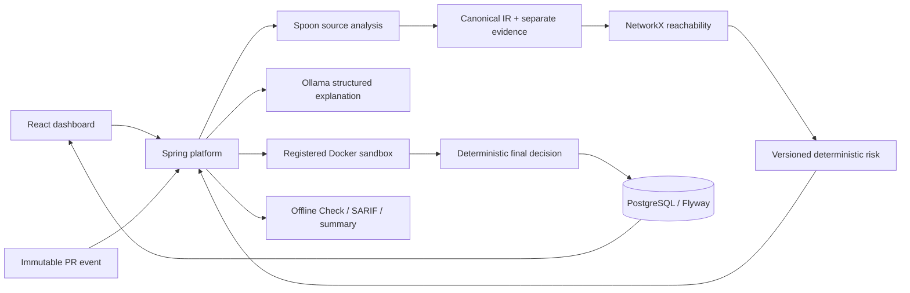
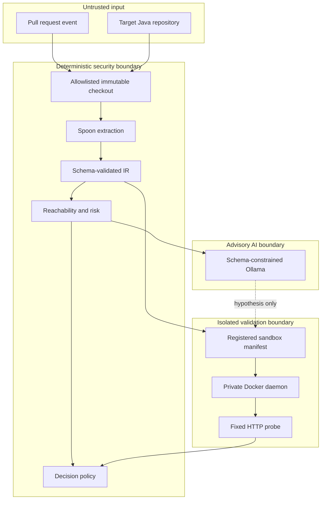
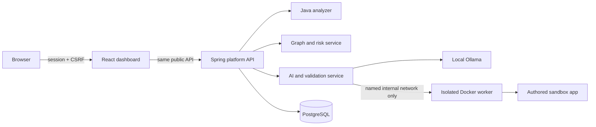

# Architecture

RiskGraph AI is a modular monorepo built around stable contracts. The platform
backend orchestrates scans and owns persistence. Analysis services stay focused
on one deterministic responsibility each, and the AI layer only explains evidence
or proposes validation tests.

## Service Flow

```text
GitHub PR or manual scan
        |
        v
services/platform-api
  orchestration, users, projects, scans, decisions, database writes
        |
        v
services/java-analyzer
  Git diff and Spring annotation extraction, outputs endpoint IR
        |
        v
services/graph-risk-service
  graph construction, graph diff, reachability, deterministic risk scoring
        |
        v
services/ai-validation-service
  Ollama explanation, HTTP test suggestion, Docker-only validation
        |
        v
services/platform-api
  final ALLOW, REVIEW, or BLOCK decision persisted and exposed to dashboard
```

## Analysis pipeline



## Trust boundaries



Target source is parsed but never built or executed. The AI response cannot create
graph edges, change risk, or confirm a finding. Validation accepts only registered
local images and a fixed structured HTTP authorization probe.

## Local deployment



The local Docker worker accepts a fixed structured authorization probe, verifies
image/commit identity, and creates an internal network with non-root, read-only,
resource-limited containers. AI never supplies an executable shell command.
The platform implements session authentication, CSRF protection, GitHub connection
checks, login throttling, and Developer, Security Analyst, and Admin authorization.
The default deployment remains a local academic MVP and requires production-specific
TLS, secret management, and operations controls before internet exposure.

- `contracts/` is the source of truth for service communication.
- `platform-api` is the only service that writes to PostgreSQL.
- Analysis services should be stateless where possible.
- `java-analyzer` never scores risk.
- `graph-risk-service` never calls an LLM.
- `ai-validation-service` never assigns risk or confirms findings by itself.
- Validation only targets local Docker sandbox applications.
- `dashboard` talks only to `platform-api`.
- Ollama is external and configured through `OLLAMA_BASE_URL`.

## Why This Shape

The architecture separates deterministic security facts from AI interpretation.
That keeps the MVP explainable, testable, and aligned with the project discipline:
deterministic analysis produces evidence, graph algorithms produce structural
facts, AI interprets and hypothesizes, and validation confirms or rejects.
